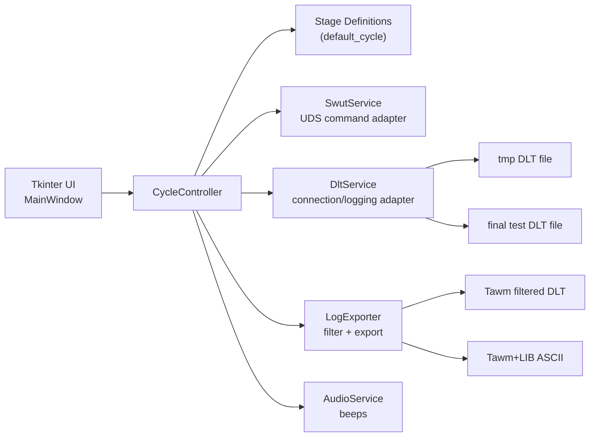
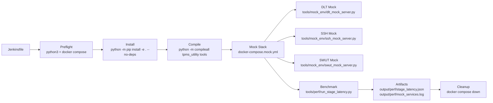
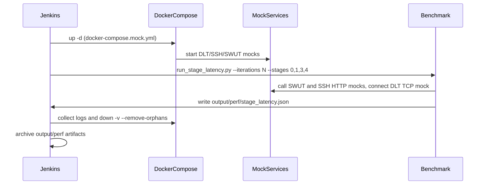
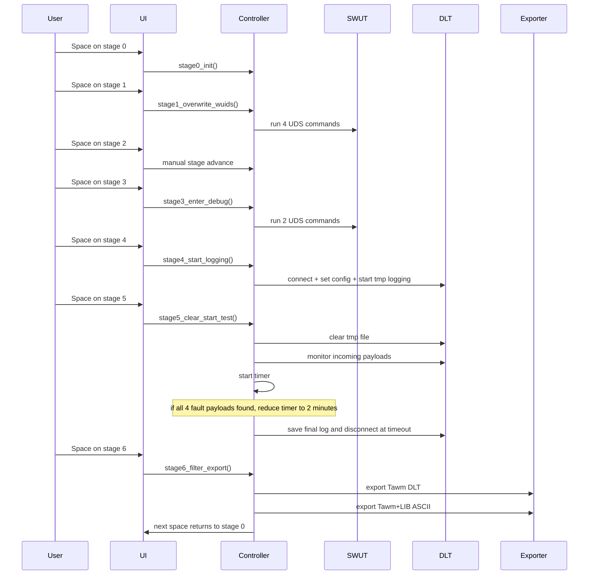

# Architecture

## Implemented architecture (prototype)

## Optimization pipeline architecture

## Optimization pipeline sequence

## Stage execution sequence (0-6)

## Key extension points

- Real SWUT integration: `tpms_utility/services/swut_service.py`
- Embedded DLT viewer integration: `tpms_utility/services/dlt_service.py`
- Stage behavior customization: `tpms_utility/stages/default_cycle.py`
- UI design changes (layout/visual flow): `tpms_utility/ui/main_window.py`
- CI optimization entrypoint: `Jenkinsfile`
- Mock service behavior and fault/latency injection: `tools/mock_env/*.py`
- Stage latency benchmark behavior and output schema: `tools/perf/run_stage_latency.py`
